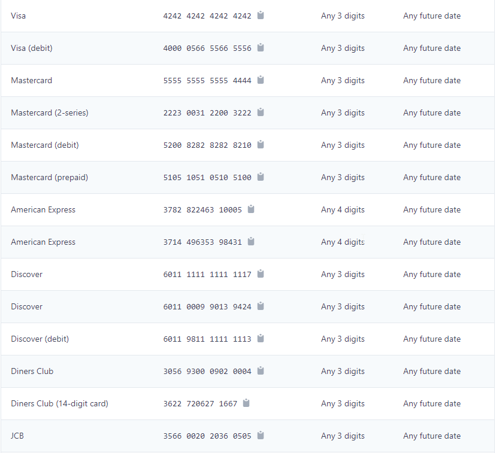

## Stripe Basic UI

This is a basic UI for Stripe. It is a test project for Stripe and is not intended for production use.

### Setup

- [x] Required Packages
  - [x] cors
  - [x] dotenv
  - [x] express
  - [x] stripe
- [x] Create a Stripe account
  - [x] Stripe Publishable Key - (pk*test*...) - (Frontend)
  - [x] Stripe Secret Key - (sk*test*...) - (Backend)

### Stripe Test Cards

<a href="https://stripe.com/docs/testing?numbers-or-method-or-token=card-numbers" alt="Test Card" >

</a>

### Run The App

```bash
npm install
npm run server
```
